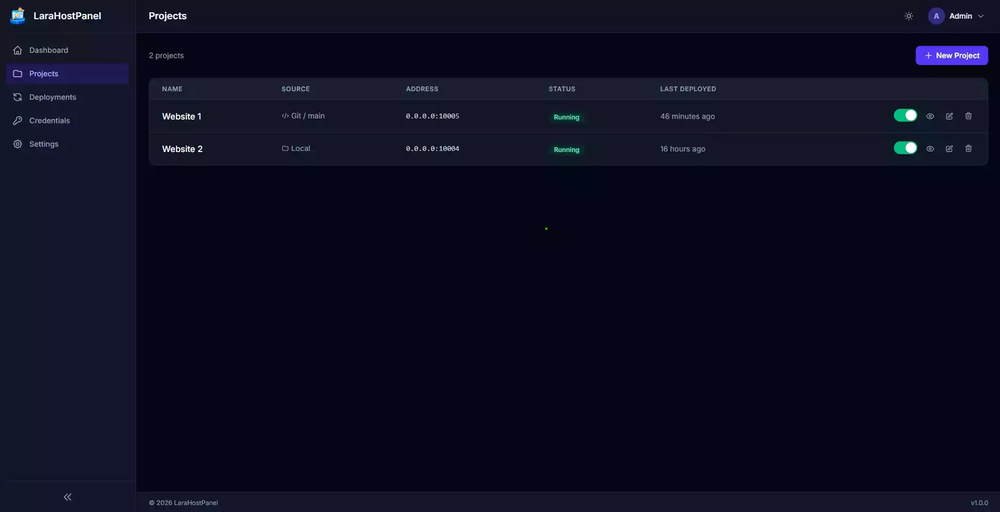
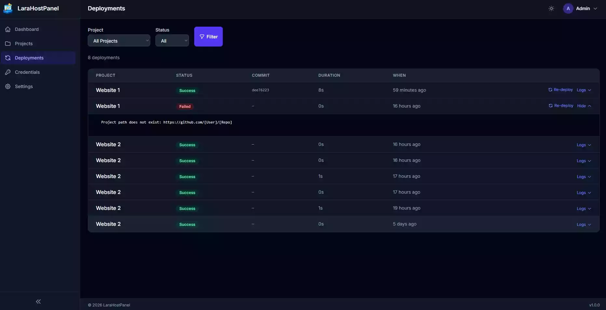
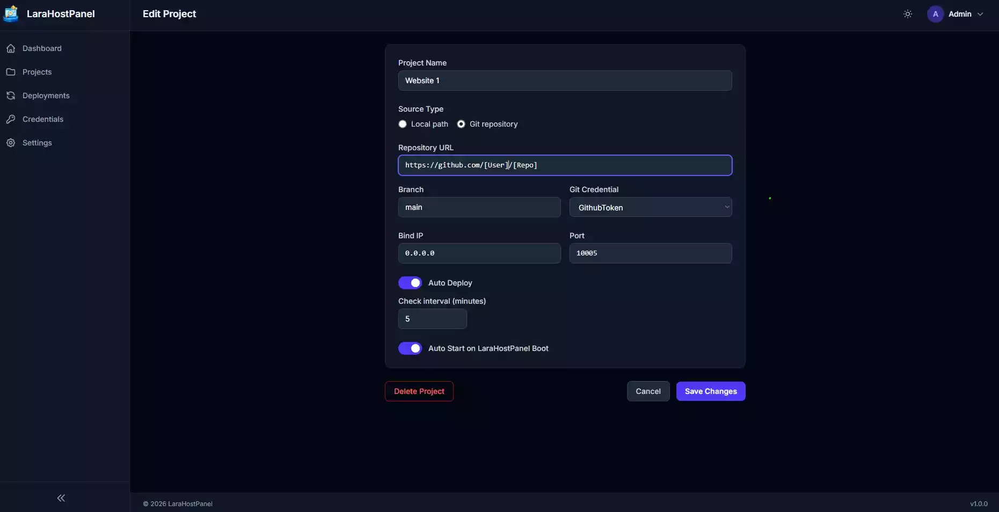
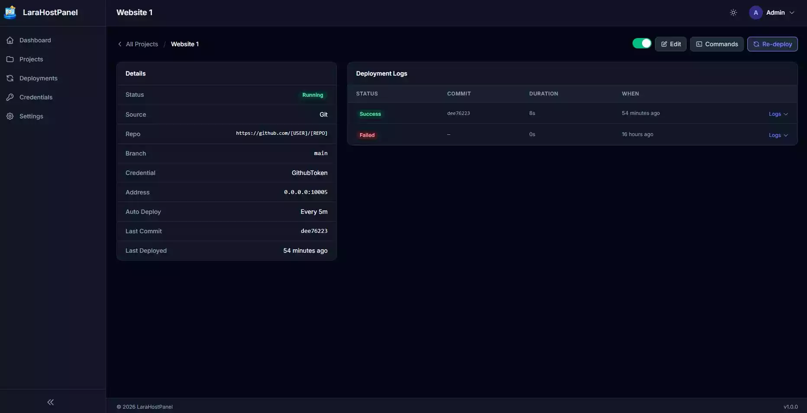

<p align="center">
  
</p>

<p align="center">
  <strong>A basic self-hosted Laravel project manager — deploy, run, monitor and command your Laravel apps from a single panel.</strong>
</p>

<p align="center">
  
  
  
  
</p>

<p align="center">
  <a href="https://www.buymeacoffee.com/armysarge">
    
  </a>
</p>

---

> **⚠️ Alpha Software**
>
> LaraHostPanel is currently in **alpha**. It is functional but under active development and may contain bugs, incomplete features, rough edges, or breaking changes between releases. Use in production environments is at your own risk. Feedback, bug reports, and contributions are very welcome.

---

## Screenshots

| Projects List | Deployments |
|---|---|
|  |  |


| Projects Edit | Projects Logs|
|---|---|
|  |  |
---

## Overview

**LaraHostPanel** is a self-hosted web control panel for managing multiple Laravel (and plain PHP) applications on a single server. Add projects from a local filesystem path or a Git repository, assign each one a bind address and port, bring them up or down on demand, run artisan / shell commands directly from the browser, and watch deployment logs — all from one clean, dark-mode-friendly interface.

Key design goals:

- **Zero external dependencies** — uses SQLite and PHP's built-in server by default; no Docker, no Nginx, no Node daemon required.
- **Audit trail** — every deployment and command execution is logged with its output and exit code, available for review at any time.

---

## Features

| Area | Feature |
|---|---|
| **Projects** | Register projects by local path or Git URL |
| **Start / Stop** | Toggle any project on or off with a single click |
| **Git Deploy** | Clone or pull the latest code and start the PHP server automatically |
| **Manual Re-deploy** | Force a fresh pull and restart for any git-sourced project |
| **Auto-Deploy** | Periodic background polling; re-deploys when upstream commits are detected |
| **Auto-Start** | Optionally restart projects automatically when the panel itself boots |
| **Deployment Logs** | Full per-deployment log: commit hash, output, duration, success/failure |
| **Commands** | Run any shell command in the project directory from the browser |
| **Artisan Presets** | One-click preset buttons for common artisan and npm/composer tasks |
| **Live Terminal Output** | Command output streams live in a dark terminal panel; auto-scrolls while running |
| **Environment Editor** | Read and write the `.env` file for local projects directly in the panel |
| **Git Credentials** | Store SSH keys or personal access tokens for private repositories |
| **Dark Mode** | Full dark/light theme with persistent user preference |
| **Profile & Password** | Update your own display name, email and password from the settings page |

---

## Requirements

| Requirement | Version |
|---|---|
| PHP | >= 8.3 |
| Composer | Any recent version |
| Git | Required for git-sourced projects |
| SQLite extension | Bundled with most PHP installs |

> Node.js / npm is **not** required to run LaraHostPanel itself, but projects you manage through it may need it.

---

## Quick Start

### 1. Clone the repository

```bash
git clone https://github.com/armysarge/LaraHostPanel.git
cd LaraHostPanel
```

### 2. Install PHP dependencies

```bash
composer install --no-dev --optimize-autoloader
```

### 3. Configure environment

```bash
cp .env.example .env
php artisan key:generate
```

The defaults use a local SQLite database and file-based sessions — no database server needed.

### 4. Run migrations

```bash
touch database/database.sqlite
php artisan migrate --seed
```

> **Default login credentials**
>
> | Field | Value |
> |---|---|
> | Email | `admin@larahostpanel.local` |
> | Password | `password` |
>
> **Change the password immediately after first login** via *Settings → Password*.

### 5. Start the panel

```bash
php artisan serve --host=0.0.0.0 --port=8001
```

Or use the included helper script:

```bash
bash scripts/start.sh
```

Open [http://localhost:8001](http://localhost:8001) in your browser.

### 6. (Optional) Install as a systemd service

```bash
sudo bash scripts/install-service.sh
```

This registers LaraHostPanel as a systemd service so it starts automatically on boot.

---

## Project Sources

### Local Path

Point LaraHostPanel at any PHP / Laravel project already present on the host:

```
/home/user/projects/my-laravel-app
```

When started, a `php artisan serve` (if an `artisan` file is detected) or `php -S` server is launched bound to the configured IP and port.

### Git URL

Provide a Git remote URL and LaraHostPanel will clone, start, and optionally keep the project up to date automatically:

```
https://github.com/youruser/my-laravel-app.git
git@github.com:youruser/private-repo.git
```

Clones are stored under `storage/app/deployments/{project_id}/`.

For private repositories, add credentials first through the **Credentials** page, then select them when creating or editing a project.

---

## Git Credentials

Two credential types are supported:

| Type | Usage |
|---|---|
| **Personal Access Token** | Automatically embedded in the HTTPS clone URL |
| **SSH Key** | Written to a temporary file for the duration of the git operation; deleted immediately after |

Credentials are stored encrypted at rest and are never exposed in the UI after creation.

---

## Auto-Deploy

Git-sourced projects can be configured to poll for upstream changes on a schedule:

1. Enable **Auto Deploy** on the project edit page.
2. Set the **Check interval** (1–1440 minutes).
3. LaraHostPanel will `git fetch` + `git reset --hard origin/<branch>` on the configured schedule and restart the PHP server if new commits are found.

The last deployed commit hash is tracked and shown on the project detail page.

---

## Command Runner

Every project has a **Commands** page (`/projects/{id}/commands`) where you can run arbitrary shell commands in the project's working directory.

### Preset commands

Quick-fill buttons are provided for the most common tasks:

| Category | Commands |
|---|---|
| **Database** | Migrate, Migrate:Fresh, DB Seed |
| **Cache** | Cache Clear, Config Cache, Config Clear, Route Cache, Route Clear, View Clear, Optimize |
| **Files** | Storage Link |
| **Queue** | Queue Restart |
| **Dependencies** | Composer Install, NPM Install, NPM Build |

### Running a custom command

Type any command in the input field and press **Run**. The command is launched as a background process; output appears in a live-streaming terminal panel and is polled every 1.5 seconds until the process exits.

### Concurrency

Command runs and deployments are fully independent. You can:

- Trigger a re-deploy while a `composer install` is still running.
- Run `php artisan migrate` immediately after a deployment completes.
- Run multiple commands back to back; all are tracked with their full output.

Each command run records the command text, label, start time, exit code, and complete output for later review.

---

## Deployment Logs

Every start / deploy operation writes a `DeploymentLog` entry containing:

- Status (`success` / `failed`)
- Commit hash (git projects)
- Full git + server startup output
- Start and completion timestamps
- Duration

Logs are accessible from the project detail page and the global **Deployments** list, where you can also trigger a re-deploy directly from any log entry.

---

## Roadmap

- [ ] Security hardening (input sanitization, rate limiting, etc.)
- [ ] Secure authentication (2FA, OAuth, SSO)
- [ ] User management and permissions (multi-user support)
- [ ] Deployment webhooks (push-triggered deploys via GitHub / GitLab)
- [ ] SSL / TLS certificate provisioning (Let's Encrypt integration)
- [ ] Role-based access control (multi-user support)
- [ ] Backup & restore per project
- [ ] Notification integrations (Slack, email, webhook)
- [ ] Resource usage graphs and historical metrics
- [ ] Scheduled artisan commands per project
- [ ] Support for non-PHP projects (Node.js, Python, etc.)

---

## Security Notes

- LaraHostPanel is designed to run on a **trusted internal network** or behind a reverse proxy with authentication — not directly exposed to the public internet.
- The `.env` editor and command runner grant significant control over the host server. Restrict access accordingly.
- Default credentials must be changed after installation.
- SSH keys are stored in the database; ensure your database file has appropriate filesystem permissions (`chmod 600 database/database.sqlite`).

---

## Contributing

Contributions are welcome. Please open an issue first for significant changes so we can discuss the approach.

1. Fork the repository
2. Create a feature branch (`git checkout -b feature/my-feature`)
3. Commit your changes
4. Open a pull request

Please read [CONTRIBUTING.md](CONTRIBUTING.md) for the full code of conduct and process.

---

## License

Licensed under the MIT License. See [LICENSE](LICENSE) for details.

---

## ☕ Buy me a coffee

If LaraHostPanel saves you time, consider supporting development!

[](https://buymeacoffee.com/armysarge)

---
