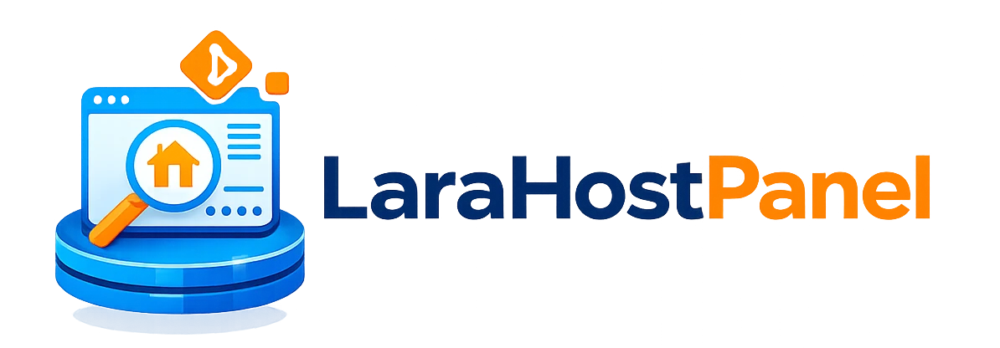

<p align="center">
  
</p>

<p align="center">
  <strong>A self-hosted Laravel project manager — deploy, run, monitor and auto-update your Laravel apps from a single panel.</strong>
</p>

<p align="center">
  
  
  
  
</p>
<p align="center">
[](https://www.buymeacoffee.com/armysarge)
</p>

---

## Overview

**LaraHostPanel** is a self-hosted control panel for managing multiple Laravel applications on a single server. Add projects from a local path or a Git repository, assign them an IP and port, bring them up or down on demand, and watch live metrics — all from one clean interface.

Git-sourced projects are polled on a configurable schedule; when upstream changes are detected the project is automatically re-deployed with zero manual intervention.

---

## Features

| Feature | Description |
|---|---|
| **Project Registry** | Add Laravel projects by local filesystem path or public/private Git URL |
| **Flexible Deployment** | Assign each project a custom IP address and port |
| **Start / Stop Control** | Toggle any project on or off without touching the server |
| **Live Monitoring** | View status, uptime, resource usage and recent log output per project |
| **Git Auto-Deploy** | Periodic polling detects upstream commits and re-deploys automatically |
| **Docker-backed** | Every project runs in an isolated container stack |

---

## Requirements

- Docker >= 24
- Docker Compose v2
- Git (for Git-sourced projects)

---

## Quick Start

### 1. Clone the repository

```bash
git clone https://github.com/youruser/LaraHostPanel.git
cd LaraHostPanel
```

### 2. Configure environment

```bash
cp .env.example .env
```

Edit `.env` and set at minimum:

```env
APP_PORT=8000           # Port the panel is served on
PHPMYADMIN_PORT=8080    # phpMyAdmin (optional)

DB_DATABASE=larahostpanel
DB_USERNAME=larahostpanel
DB_PASSWORD=secret
DB_ROOT_PASSWORD=secret
```

### 3. Build and start

```bash
docker compose up -d --build
```

### 4. Bootstrap Laravel

```bash
docker exec larahostpanel_app php artisan key:generate
docker exec larahostpanel_app php artisan migrate --force
docker exec larahostpanel_app php artisan db:seed
```

> **Default login credentials**
> | Field | Value |
> |---|---|
> | Email | `admin@larahostpanel.local` |
> | Password | `password` |
>
> **Change these immediately after first login.** Update `database/seeders/DatabaseSeeder.php` before seeding, or change your password through the panel after logging in.

### 5. Open the panel

```
http://localhost:8000
```

---

## Docker Services

| Service | Container | Default Port |
|---|---|---|
| PHP-FPM (app) | `larahostpanel_app` | — |
| Nginx | `larahostpanel_nginx` | `8000` |
| MySQL 8 | `larahostpanel_mysql` | `3306` |
| Redis | `larahostpanel_redis` | `6379` |
| phpMyAdmin | `larahostpanel_phpmyadmin` | `8080` |

---

## Project Sources

### Local Path

Point LaraHostPanel at any Laravel project already on the host:

```
/home/user/projects/my-laravel-app
```

### Git URL

Provide a Git remote and LaraHostPanel will clone, configure and deploy it:

```
https://github.com/youruser/my-laravel-app.git
git@github.com:youruser/private-repo.git
```

For private repositories, add your SSH key or personal access token through the panel's credential manager.

---

## Auto-Deploy (Git Projects)

Git-sourced projects are checked for new commits on a configurable interval (default: every 5 minutes). When changes are detected:

1. The latest code is pulled
2. Composer dependencies are updated
3. Migrations are run
4. The project container is restarted

The interval and behaviour can be configured per project.

---

## Roadmap

- [ ] Web-based terminal per project
- [ ] SSL / TLS certificate provisioning (Let's Encrypt)
- [ ] Deployment webhooks (push-triggered deploys)
- [ ] Environment variable editor per project
- [ ] Role-based access control (multi-user)
- [ ] Backup & restore per project
- [ ] Notification integrations (Slack, email, webhook)
- [ ] Resource usage graphs and historical metrics
- [ ] Support for non-Laravel PHP projects

---

## 🤝 Contributing

Contributions are welcome! Please read our [Contributing Guide](CONTRIBUTING.md) for details on our code of conduct and the process for submitting pull requests.

## 📄 License

This project is licensed under the AGPL License - see the [LICENSE](LICENSE) file for details.

## ☕ Buy me a coffee

If you like this project, consider buying me a coffee to keep me motivated!

[](https://buymeacoffee.com/armysarge)
---

Built with ❤️ for the D&D community
